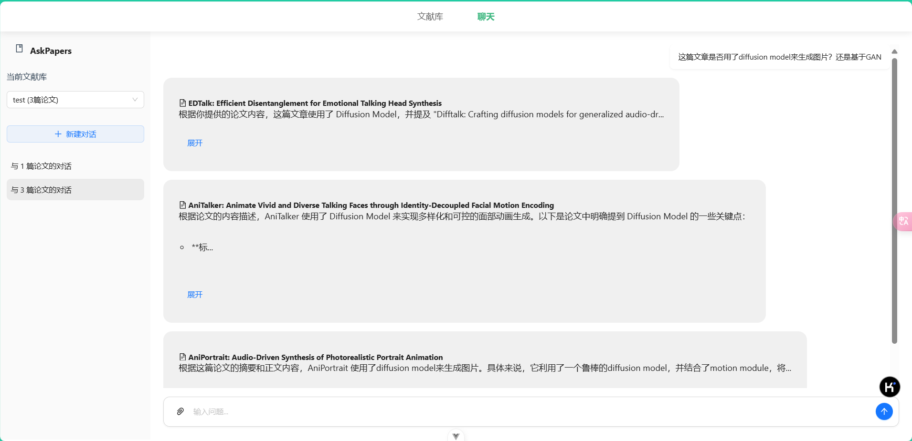

# AskPapers - 批量论文智能阅读与问答工具

## 项目概述

AskPapers 是一个用于文献综述调研的智能工具，允许用户向多篇论文提出相同问题并获取AI生成的答案。该应用程序旨在帮助研究人员更高效地进行文献综述和调研，特别是当需要从多篇论文中提取相同类型信息时。



**本项目仍在开发，文档与功能暂未完成**

## 功能特点

- **文献库管理**：创建和管理多个文献库，分类整理研究论文
- **多论文询问**：向多篇论文同时提问相同的问题，以便比较和分析
- **AI驱动回答**：利用先进的语言模型解析论文内容并提供答案
- **论文自动获取**：支持从GitHub仓库、arXiv等平台自动下载论文
- **用户友好界面**：直观的网页界面，方便操作和管理
- **历史记录**：保存问答历史，方便后续查阅和对比（待实现）


## 安装指南

### 环境要求

- Python 3.9+
- Bun (or Node.js 14+)

### 后端设置

1. 克隆仓库并进入项目目录
```bash
git clone https://github.com/elliottzheng/askpapers.git
cd askpapers/backend
```

2. 创建并激活虚拟环境
```bash
python -m venv venv
source venv/bin/activate
```
3. 安装后端依赖
```bash
pip install -r requirements.txt
```
4. 配置环境变量
在backend目录下创建`.env`文件，添加以下内容：
```ini
API_KEY=your_api_key_here
```
Gemini API的API Key可以在[这里](https://aistudio.google.com/apikey)获取。
5. 运行后端服务
```bash
python server.py
```

### 前端设置
本项目前端使用Vue 3 + TypeScript + Vite构建，您可以按照以下步骤设置前端开发环境：
1. 安装前端依赖
```bash
cd askpapers/frontend
bun install
```
2. 开发模式运行
```bash
bun dev
```


## 使用指南

### 基本操作流程

1. **创建文献库**：首先创建一个新的文献库，为您的研究项目命名
2. **添加论文**：通过URL添加论文（支持GitHub仓库链接或直接上传PDF文件）
3. **创建对话**：选择一个或多个论文开始新对话
4. **提问**：向选定的论文提出问题，获取AI生成的答案
5. **查看历史**：随时回顾之前的问答记录

## 技术栈

- **前端**：Vue 3 + TypeScript + Vite
- **后端**：Flask (Python)
- **AI模型**：[Gemini API](https://aistudio.google.com/)，大家都可以免费使用的


## 致谢

感谢arXiv提供的开放访问互操作性，感谢[Cool Paper](https://papers.cool/)提供的论文检索服务。
同时，特别感谢所有持续改进该应用的开发者和贡献者。

## 许可证

本项目采用 MIT 许可证
